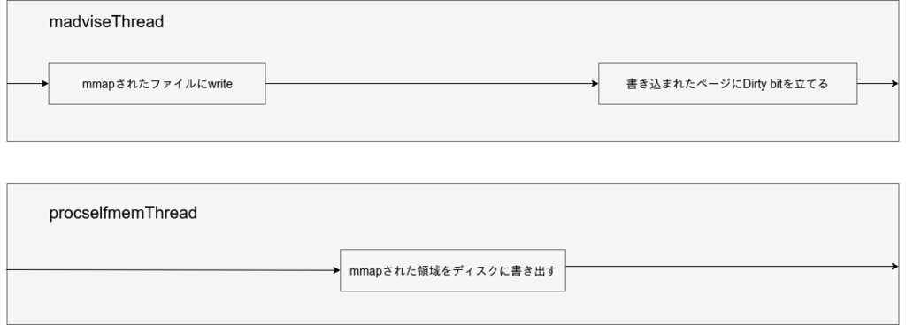

+++
title = "Dirtycowはどのように動くか"
date = "2018-08-11"
tags = [
    "security",
]
+++

<!--more-->

DirtyCowについて調べたので理解するのに必要となる前提知識と一緒にPoCについての説明をまとめておきます。

rootを取ったり、REHLで動くものがありますが今回は一番基本的な、権限のないファイルに書き込むPoC([https://github.com/dirtycow/dirtycow.github.io/blob/master/dirtyc0w.c:title])についてまとめます。

# DirtyCowについて

DirtyCowはCopy on Writeの取り扱いにおいて競合状態が発生し、プライベートなメモリマッピングが破壊されるというものです。
CVEではCVE-2016-5195として管理されています。
[https://jvndb.jvn.jp/ja/contents/2016/JVNDB-2016-005596.html:title]

# 前提知識など

## mmap

mmapはファイルやデバイスをメモリにマッピングするためのものです。

readやwriteを使うとカーネル空間からユーザープロセスへのコピーが発生しますが、mmapはマッピングしたアドレスを返すだけでユーザー空間へのコピーが発生しません。

そのためreadやwriteを使うよりも効率期にファイルの読み書きが可能になるようです。

"なるようです"と書いたのはどの場合においてもmmapのほうが早いわけではないからです。

日本語で詳しく解説されている[記事](https://www.allbsd.org/~hrs/blog/2017-01-02-read-mmap.html)があったのでどうぞ。

`man mmap`してでてくる情報を簡単にまとめます。
プロトタイプ宣言は次のようになっています。
```c
void *mmap(void *addr, size_t len, int prot, int flags, int fildes, off_t off);
```

addrにはマッピングするアドレスを指定します。NULLを指定するとマッピングするアドレスをカーネルが決定してくれます。

lenにはマッピングするサイズを指定します。

protにはPROT_EXEC, PROT_READ, PROT_WRITE, PROT_NONEを指定します。それぞれ、実行可能、読み書き可能、書き込み可能、アクセス不可能を表します。

flagsには、MAP_SHARED, MAP_PRIVATE, MAP_FIXEDが指定できます。MAP_PRIVATEが指定されるとCopy on Writeでファイルがマッピングされます。

fildesにはファイルディスクリプタを指定します。

offにはファイルのオフセットを指定します。

mmapを利用した簡単なファイルを読み込むをするサンプルを書いてみました。
```c
#include <stdio.h>
#include <sys/mman.h>
#include <sys/types.h>
#include <sys/stat.h>
#include <fcntl.h>

int main(int argc, char *argv[]){
  if (argc <= 1) {
    printf("please specify filename\n");
    return 1;
  }

  int fd = open(argv[1],O_RDONLY);
  if (fd < 0) {
    printf("file not found\n");
    return 1;
  }
  printf("file discriptor: %d\n", fd);

  struct stat st;
  fstat(fd, &st);
  printf("file size: %ld\n", st.st_size);

  char* map = mmap(NULL,st.st_size,PROT_READ,MAP_PRIVATE,fd,0);
  printf("%s\n", map);

  return 0;
}
```
更に詳しい情報は`man mmap`で得られます。


## Copy on Write

Copy on Writeとは書き込みが行われるまでは元から存在するマッピングを利用し、書き込みが起こったと同時にメモリ上に新たに複製が作られるという動作のことをいいます。

これによってforkするたびに、メモリ上に複製を作るより効率よくメモリを利用することができます。

書き込みによって作られた新たな複製は、他のプロセスからは見ることができません。

ここで実験のために少しコードを書いてみようと思います。

先ほど説明したように、書き込みが行われるまでは同じマッピングを利用し、書き込みが行われるときに新たな領域が確保され、複製されます。

プロセスのファイルマッピングは<i>/proc/{pid}/smaps</i>で確認することができます。

出力はだいたいこんなのが得られます。
```
Size:                  4 kB
KernelPageSize:        4 kB
MMUPageSize:           4 kB
Rss:                   0 kB
Pss:                   0 kB
Shared_Clean:          0 kB
Shared_Dirty:          0 kB
Private_Clean:         0 kB
Private_Dirty:         0 kB
Referenced:            0 kB
Anonymous:             0 kB
LazyFree:              0 kB
AnonHugePages:         0 kB
ShmemPmdMapped:        0 kB
Shared_Hugetlb:        0 kB
Private_Hugetlb:       0 kB
Swap:                  0 kB
SwapPss:               0 kB
Locked:                0 kB
VmFlags: rd mr mw me
```
これを利用してみます。

先程の説明通りなら、書き込みを行うまでは親プロセスと子プロセスのメモリマッピングは同じ、親プロセスか子プロセスどちらかで書き込むとメモリマッピングが変わるはずです。

次のようなコード書いて実験してみます。

```c
#include <stdio.h>
#include <stdlib.h>
#include <stdint.h>
#include <fcntl.h>
#include <unistd.h>
#include <string.h>
#include <errno.h>
#include <sys/mman.h>
#include <sys/types.h>
#include <sys/stat.h>
#include <sys/wait.h>

#define IS_WRITE 1

int fd;
struct stat st;
void *map;

int main(int argc, char *argv[]){
  if (argc <= 1) {
    printf("please specify filename\n");
    return 1;
  }

  fd = open(argv[1],O_RDWR);

  if (fd < 0) {
    fprintf(stderr, "%s\n", strerror(errno));
    return 1;
  }

  fstat(fd, &st);

  // MAP_PRIVATE(copy on write)でマッピング
  map = (char *)mmap(NULL,st.st_size,PROT_WRITE,MAP_PRIVATE,fd,0);

  // 読み込み
  FILE *f = fopen("/dev/null", "w");
  fprintf(f, "%s\n", map);

  if (map == MAP_FAILED) {
    fprintf(stderr, "%s\n", strerror(errno));
    return -1;
  }

  int pid = getpid();
  printf("(main) pid: %d\n", pid);

  // -------------------
  // fork
  // -------------------
  int status;
  pid = fork();

  if (pid == 0) {
    pid = getpid();
    printf("(fork) pid: %d\n", pid);

    // 読み込み
    FILE *f = fopen("/dev/null", "w");
    fprintf(f, "%s\n", map);

    if (!IS_WRITE) sleep(100);

    // 書き込み
    strcat(map, "A");
    if (IS_WRITE) sleep(100);
  }

  wait(&status);
  // -------------------

  if (munmap(map, st.st_size) == -1){
    fprintf(stderr, "%s\n", strerror(errno));
    return -1;
  }
  return 0;
}
```

マッピングした領域に書き込む前にsleepを挟んでからコンパイルして実行します。

sleepに入ったらcat /proc/{pid}/smaps | grep -A 20 filenameして子プロセスのマッピングをみます。

```
Size:                  4 kB
KernelPageSize:        4 kB
MMUPageSize:           4 kB
Rss:                   4 kB
Pss:                   2 kB
Shared_Clean:          4 kB
Shared_Dirty:          0 kB
Private_Clean:         0 kB
Private_Dirty:         0 kB
Referenced:            4 kB
Anonymous:             0 kB
LazyFree:              0 kB
AnonHugePages:         0 kB
ShmemPmdMapped:        0 kB
Shared_Hugetlb:        0 kB
Private_Hugetlb:       0 kB
Swap:                  0 kB
SwapPss:               0 kB
Locked:                2 kB
VmFlags: wr mr mw me ac
```

Shared_Cleanが4kBになってます。

親プロセスと子プロセスで同じファイル触っているので共有されていますね。

書き込みをしてから親プロセスのマッピングを見てみます。
```
Size:                  4 kB
KernelPageSize:        4 kB
MMUPageSize:           4 kB
Rss:                   4 kB
Pss:                   4 kB
Shared_Clean:          0 kB
Shared_Dirty:          0 kB
Private_Clean:         0 kB
Private_Dirty:         4 kB
Referenced:            4 kB
Anonymous:             4 kB
LazyFree:              0 kB
AnonHugePages:         0 kB
ShmemPmdMapped:        0 kB
Shared_Hugetlb:        0 kB
Private_Hugetlb:       0 kB
Swap:                  0 kB
SwapPss:               0 kB
Locked:                4 kB
VmFlags: wr mr mw me ac
```
Private_Dirtyが4kBになりましたね。

マッピングしていたファイルが新しいプロセスのためにメモリ上に新たに複製されました。

## madvise
madviseはカーネルに、メモリのページング処理についてアドバイスを出すために使用します。

```c
int madvise(void *addr, size_t length, int advice);
```
addrにはアドレスを、lengthにはサイズ、adviceにはカーネルに対するアドバイスを渡します。詳細は`man madvise`で。

DirtyCowではadviceにMADV_DONTNEEDが渡されています。

これは、しばらくは指定されたアドレスへのアクセスはなさそうなのでmmapしたメモリは一旦開放して良いということをカーネルに伝えるものです。

これによってmmapしたファイルは開放され、次に読み込むときは再びIOが発生し、メモリに読み込まれます。
元ファイルが削除されていた場合は0fillされます。

# PoCコードの解説
https://github.com/dirtycow/dirtycow.github.io/blob/master/dirtyc0w.c

PoCの大まかな動作としては、mainで読み込みたいファイルをmmap, それからmadviseThread, procselfmemThreadを各スレッドで動かしています。

madviseThreadではmadviseをループして何度も実行、procselfmemThreadでは自分のプロセスのメモリである<i>/proc/self/mem</i>を開き、mmapされた場所に文字列を書き込み続けています。

この2つの動作が連続することにより競合状態が発生し、プライベートなメモリマップであるはずのものがディスクに書き込まれてしまいます。

これを理解する上で重要なのはページキャッシュの動作です。

ページキャッシュの動作として、読み込みが行われると、読み込んだものはキャッシュに置かれ、書き込みが行われると、即座に書き込みは行われず、キャッシュに書き込んだ上で適当なタイミングで書き込みが行われます。Linuxカーネルではキャッシュに書き込みを行うと書き込んだページにDirty bitが立てられます。

先ほど説明したmadviseとwriteを繰り返すと、writeを行ってからDirty bitを立てる前にmadviseによってページがディスクに書き込まれることによって、権限の無いファイルに書き込みができてしまうというわけです。

draw.ioで2秒くらいで書いた図によるとこんな感じです。




# 最後に
本当はパッチを読んだりしてたんですがこれ以上長くなるとしんどいのでやめました。

DirtyCowのパッチには不十分で、THPを使用している場合にはCoWを用いることなくdirty bitを立てることができるらしいですね。

気が向いたらパッチを読みつつ不十分だった部分など解説します。
